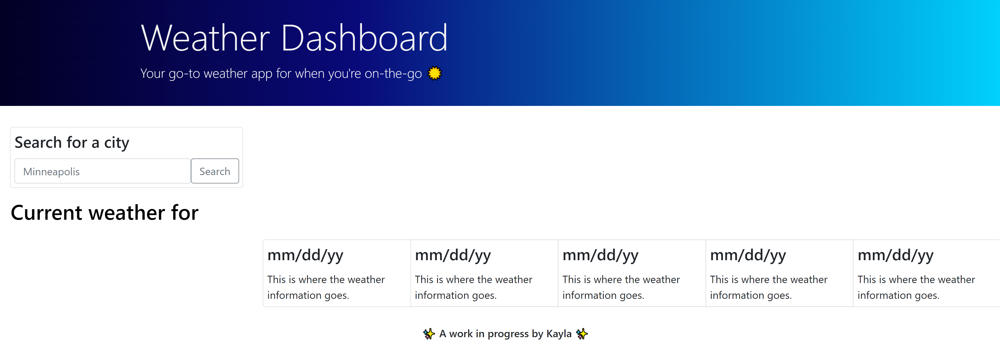

# 06 Server-Side APIs: Weather Dashboard


## Introduction

This is a homework assignment (Challenge) to build a weather dashboard that will run in the browser and feature dynamically updated HTML and CSS. Third-party APIs allow developers to access their data and functionality by making requests with specific parameters to a URL. Developers are often tasked with retrieving data from another application's API and using it in the context of their own.


## Challenge Requirements

The requirements for the homework assignment are included below.


## User Story

```
AS A traveler
I WANT to see the weather outlook for multiple cities
SO THAT I can plan a trip accordingly
```

## Acceptance Criteria

```
GIVEN a weather dashboard with form inputs
WHEN I search for a city
THEN I am presented with current and future conditions for that city and that city is added to the search history
WHEN I view current weather conditions for that city
THEN I am presented with the city name, the date, an icon representation of weather conditions, the temperature, the humidity, and the wind speed
WHEN I view future weather conditions for that city
THEN I am presented with a 5-day forecast that displays the date, an icon representation of weather conditions, the temperature, the wind speed, and the humidity
WHEN I click on a city in the search history
THEN I am again presented with current and future conditions for that city
```


## Link to application

https://justkayla.github.io/06-weather-dashboard/


## Screenshot

Below is the draft version of my weather forecast project.




## Contributor

Kayla Justice &copy;2022 